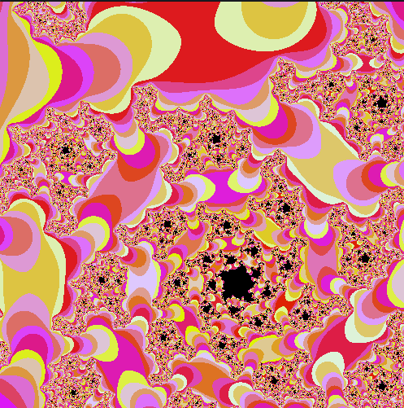
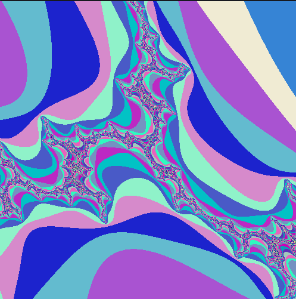

# 🌌 fract-ol

> A 42 project for exploring beautiful and complex fractals using the MiniLibX graphics library.
> This program renders multiple fractal types with real-time interaction and zooming.

## 🧠 Project Objective

Build a graphical program using **MiniLibX** that can display different fractals, zoom and move around them, and interact in real time.

---

## 🚀 Usage

```bash
./fractol <fractal_name>
```

### Example:

```bash
./fractol mandelbrot
```

---

## 🌀 Available Fractals

* `mandelbrot`
* `julia`
* `tricorn`
* `celtic_mandelbar`
* `burning_ship`
* `newton`

---

## 🎮 Controls

| Key       | Action                   |
| --------- | ------------------------ |
| Arrows    | Move fractal             |
| `+` / `-` | Zoom in / out            |
| Scroll    | Zoom in / out            |
| `R`       | Reset view               |
| `WASD`    | Change Julia parameters  |
| `Space`   | Change colors            |
| `L`       | Lock / unlock animation  |
| `N` / `M` | Something interesting 🙂 |

---

## 📷 Screenshots & Visuals

### Mandelbrot


### Julia




### Tricorn





### Celtic Mandelbar


### Burning Ship


### Newton


